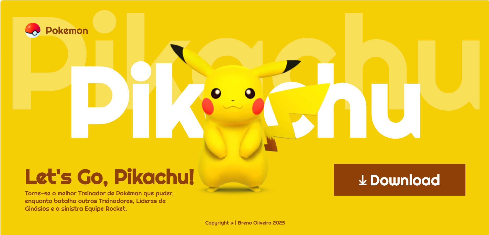

# Landing Page - Lets Go, Pikachu
## Sobre
Projeto desenvolvido a partir de uma video aula, com o objetivo de criar uma página simples e responsiva sobre o Pikachu.
Ao acompanhar o passo a passo, minha compreensão sobre responsividade e construção de layouts foi ampliada.
Esse processo me permitiu perceber uma abordagem diferente em relação a um projeto semelhante que eu havia desenvolvido anteriormente, contribuindo para o meu aprimoramento técnico.

## Tecnologias
- HTML
- CSS
- Responsividade
## Autor
- [Breno Oliveira](https://www.linkedin.com/in/breno-oliveira-assis-reis-203010351/)
